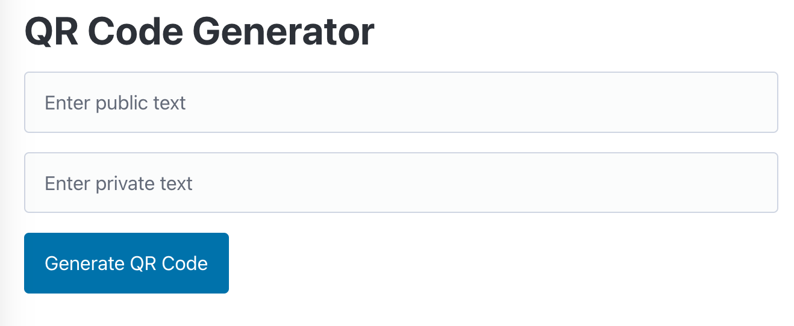

# QR Code - Doc

## 개요

[site](https://jung-family-nas.github.io/qrcode/)에서 비밀 QR코드를 생성할 수 있습니다.

## QR코드 생성

공개할 내용을 `public text`에 입력,

비공개할 내용을 `private text`에 입력후,

`Generate QR Code` 클릭.

## QR코드 인식

생성된 QR이미지의 예시.

### 일반 카메라

일반 카메라로 인식 시, `public text`의 내용만 확인 가능.

### 앱 카메라

버튼을 누른 후, 카메라 사용 허용

해당 카메라로 인식 시, `private text`의 내용도 확인 가능